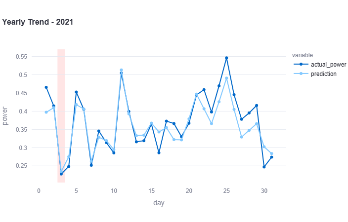

# 🌬️ Production-Ready Wind Power Forecasting System

An end-to-end machine learning platform for forecasting wind power generation using XGBoost and Bayesian hyperparameter optimization with Optuna.

The project goes beyond model development by implementing a complete MLOps workflow including experiment tracking and model registry with MLflow, Docker containerization, CI/CD automation, AWS ECS deployment, and a Streamlit-based inference service for scalable and reproducible predictions.

### Key Highlights

- ⚡ Time-series wind power forecasting
- 🚀 XGBoost model with Optuna Bayesian optimization
- 📊 Experiment tracking and model registry with MLflow
- 🐳 Dockerized application stack
- 🔄 Automated CI/CD pipeline
- ☁️ AWS ECS deployment
- 🚀 Streamlit-based model serving
- 📈 Interactive prediction dashboard with real-time performance evaluation and visualization

## System Architecture

→ Raw Data

→ Data Preprocessing and Feature Engineering

→ Optuna Hyperparameter Search

→ MLflow Tracking

→ Best Model Selection

→ MLflow Model Registry

→ Docker Build

→ GitHub Actions CI/CD

→ AWS ECS Deployment

→ Streamlit Inference Service

## Problem Statement

Accurate wind power forecasting is critical for:

* Grid stability
* Energy trading
* Renewable energy integration
* Power dispatch planning
* Reducing operational costs

Traditional forecasting approaches struggle to capture nonlinear relationships between weather conditions and power generation. This project leverages gradient boosting techniques to model these complex interactions and provide accurate short-term forecasts.

## Dataset

Source:
https://www.kaggle.com/datasets/mubashirrahim/wind-power-generation-data-forecasting

Features include:

- Temperature
- Relative humidity
- Dew point
- Wind speed
- Wind direction
- Wind gusts 

Target:

- Wind Power Output (Turbine output, normalized to be between 0 and 1 i.e., a percentage of maximum potential output)

## Machine Learning Pipeline

### Feature Engineering

- Missing value handling
- Temporal feature extraction
- Lag features
- Rolling window statistics
- Cyclical features
- Feature scaling and validation

### Model Selection

Gradient Boosting Model:

- XGBoost Regressor

### Hyperparameter Optimization

Optuna Bayesian optimization was used to search:

- n_estimators
- max_depth
- learning_rate
- subsample
- colsample_bytree
- gamma
- reg_alpha
- reg_lambda

Objective:

Minimize validation RMSE.

## Model Performance

Example forecast for April 3rd, 2021:

| Metric | Value |
|----------|--------|
| MAE | 0.23 |
| RMSE | 0.25 |
| Average Percentage Error | 0.30% |

### Prediction vs Actual

  

  Comparison of actual and predicted wind power output on unseen test data for April 2021.

The model successfully captures:
- Daily generation patterns
- Peak production periods
- Sudden output changes
- Seasonal variability
    
## MLOps Workflow

The project implements a production-oriented MLOps pipeline encompassing experiment tracking, model versioning, containerization, automated deployment, and cloud-based model serving.

### Experiment Tracking & Model Registry

MLflow was integrated throughout the training pipeline to ensure reproducibility and model governance.

- Track Optuna hyperparameter optimization experiments
- Log model parameters, metrics, and artifacts
- Compare model performance across runs
- Register and version the best-performing model
- Enable reproducible training and deployment workflows

### Containerization

- Dockerized training and inference environments
- Reproducible builds
- Environment consistency across development and production

### CI/CD

Automated pipeline:

1. Run tests
2. Validate model artifacts
3. Build Docker image
4. Push image to registry
5. Deploy to AWS ECS

### Cloud Deployment

AWS ECS was used to:

- Host model inference services
- Enable scalable deployment
- Simplify container orchestration

### Model Serving

Streamlit provides:

- Interactive prediction interface
- Real-time inference
- Visualization of predictions vs actual values
- Real-time performance evaluation using MAE, RMSE, and percentage error metrics
